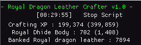
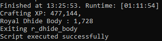

# Royal Hide Crafter v1.0
<link href="/CSS/Scripts/style.css" rel="stylesheet"/>

 

## READ BEFORE RUNNING. MAY REQUIRE USER INPUT
- Create a preset with the necessary ingredients for the craft. I.E.: A stack of thread and 27 royal dragon leathers
- Set presetKeyCode to the [virtual keycode](https://learn.microsoft.com/en-us/windows/win32/inputdev/virtual-key-codes) for the hotkey where you've set. By default it's set to F9 (default preset 9)
- Stand next to a bank booth before starting the script

## Current features:
-  Banks at a Bank booth
- Crafts Royal dragonhide body
- Prints out summary to the rs2client console when the script terminates in an expected manner. 
  - For example, clicking the "Stop script" button and waiting for it to process  or letting the script naturally close out when out of supplies.
- Stop button

## Credits:
- Higgins - I grabbed a lot from their [Lumbridge Castle Flax Spinner script](https://github.com/higgins-dotcom/lua-scripts/blob/main/LumbridgeFlaxSpinner.lua). Most notably GUI and util methods.
- Dead - I grabbed the stop button code from their [Digger script](https://me.deadcod.es/dead-digger) and used their UTILS library.  
