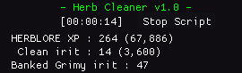

# Herb Cleaner v1.0
<link href="/CSS/Scripts/style.css" rel="stylesheet"/>

 

## Dependencies
- Download and place Dead's [utils.lua](https://me.deadcod.es/dead-utils) in  MemoryError/Lua_Scripts/
- api.lua (packaged with the MME zip) in MemoryError/Lua_Scripts/

## READ BEFORE RUNNING - MAY REQUIRE USER INPUT
- Set herbToClean - must match a key in ingredientIDs
- Set cleanHerbName - must match a key in cleanHerbIDs
- Create a preset with the necessary ingredients for the craft. I.E.: An inventory full of grimy herbs
- Set presetKeyCode to the [virtual keycode](https://learn.microsoft.com/en-us/windows/win32/inputdev/virtual-key-codes) for the hotkey of the preset you want to load. By default it's set to F8 (default preset 8)
- Place the grimy herb on your action bar
- Stand next to a bank booth before starting the script

## Current Features:
- Currently supports
  - &check; Avantoe
  - &check; Irit
-  Banks at a Bank booth
- Cleans the herbs in your inventory
- Prints out summary to the rs2client console when the script terminates in an expected manner. 
  - For example, clicking the "Stop script" button and waiting for it to process  or letting the script naturally close out when out of supplies.
- Stop button

## Adding Additional Herbs
I will update the script to include additional Herbs as I gain more Heblore levels, but if you would like to add them yourself, then you just need to update ingredientIDs and cleanHerbIDs.
- ingredientIDs
  - The key is the grimy name of the herb (case sensitive)
  - The value is the ID of the grimy herb
- cleanHerbIDs 
  - The key is the clean name of the herb (case sensitive)
  - The value is the:\
  id - ID of the clean herb\
  interface - Herblore interface ID of the herb\
  guiName - name you wish the GUI to display

## Credits:
- Higgins - I grabbed a lot from their [Lumbridge Castle Flax Spinner script](https://github.com/higgins-dotcom/lua-scripts/blob/main/LumbridgeFlaxSpinner.lua). Most notably GUI and util methods.
- Dead - I grabbed the stop button code from their [Digger script](https://me.deadcod.es/dead-digger) and used their UTILS library.  
