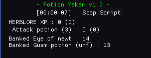

# Potion Maker v1.0
<link href="/CSS/Scripts/style.css" rel="stylesheet"/>

## Dependencies
- Download and place Dead's [utils.lua](https://me.deadcod.es/dead-utils) in  MemoryError/Lua_Scripts/
- api.lua (packaged with the MME zip) in MemoryError/Lua_Scripts/

## READ BEFORE RUNNING - MAY REQUIRE USER INPUT
- Create a preset with the necessary ingredients for the craft.
- Set presetKeyCode to the [virtual keycode](https://learn.microsoft.com/en-us/windows/win32/inputdev/virtual-key-codes) for the hotkey of the preset you want to load. By default it's set to F7 (default preset 7)
- If you set useInActionBar for an ingredient, then place that item in your actionbar.
- Stand next to a bank booth or bank chest before starting the script. 

## Current Features:
- Currently supports
  - &check; Snapdragon potion (unf)
  - &check; Super restore (3)
  - &check; Attack potion (3)
-  Banks at a Bank booth/chest
- If useInActionBar is set, it will use the ingredient in the actionbar to craft the potion. Otherwise it will look for a portable well.
  - For example, clicking the "Stop script" button and waiting for it to process  or letting the script naturally close out when out of supplies.
- Stop button

## Adding Additional Potions
- Update potionList - you can use the other potions as an example. The comments also give some hints.

## Credits:
- Higgins - I grabbed a lot from their [Lumbridge Castle Flax Spinner script](https://github.com/higgins-dotcom/lua-scripts/blob/main/LumbridgeFlaxSpinner.lua). Most notably GUI and util methods.
- Dead - I grabbed the stop button code from their [Digger script](https://me.deadcod.es/dead-digger) and used their UTILS library.  